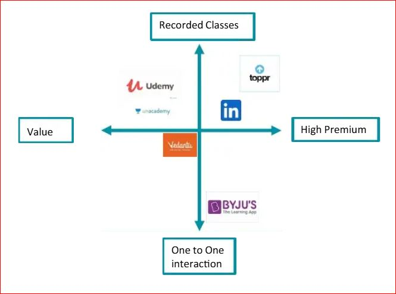

## Introduction
BYJU's, a leading Indian Edtech company, has recently encountered financial difficulties due to aggressive expansion strategies. Also we will understand the reason why users churn from BYJU's platform. 

## Company background
Byju's is an Indian multinational educational technology company founded in 2011 by Byju Raveendran. It offers online and offline courses for students of various ages, covering a wide range of subjects from K-12 to competitive exams. Byju's has grown rapidly in recent years, becoming one of the most valuable ed-tech companies globally. It has acquired several educational companies, including Osmo, WhiteHat Jr., and Aakash Educational Services, expanding its product offerings and market reach. BYJU's aquired 3 major compititors within 3yrs.

- Osmo: Acquired in January 2019 for $120 million.
- WhiteHat Jr.: Acquired in July 2020 for $300 million.
- Aakash Educational Services: Acquired in April 2021 for $1 billion.

It was founded in 2011 by Byju Raveendran and Divya Gokulnath. As of October 2024, various media outlets reported that Byju's valuation has now plummeted to zero, down from its peak valuation of $22 billion in 2022.In April 2023, the company claimed it had over 150 million registered students
Byju's app was developed by Think and Learn Pvt. Ltd, a company which was established by Byju Raveendran, Divya Gokulnath and a group of students in 2011.Byju, an engineer by profession, was coaching students in mathematics since 2006.

- Reference
  https://www.ft.com/content/9ec4a461-8f03-42c3-807f-e07774b302a7

## Shareholdings
As of July 2023, Byju Raveendran, the founder of BYJU'S, held a 17.1% stake in the company, while co-founder Divya Gokulnath owned 3.2%.The majority of BYJU'S shares were held by institutional investors, with funds collectively owning 69.86% of the company
However, in June 2024, Prosus wrote off its entire investment in BYJU'S, citing a significant decrease in value for equity investors

Reference-
https://www.statista.com/statistics/1413587/byju-s-shareholding/?
https://www.reuters.com/world/india/general-atlantic-prosus-ask-india-top-court-hear-their-concerns-byjus-insolvency-2024-08-27/

## Business Model Overview

BYJU’s operates on a freemium business model that combines free content access with premium subscription plans for advanced features. The platform provides K-12 educational content, competitive exam preparation (e.g., JEE, NEET, UPSC), and skill-based courses in collaboration with global institutions. BYJU's app uses video-based, gamified learning and personalized content delivery powered by AI to enhance user engagement.
Revenue primarily comes from subscriptions, which are sold through direct sales channels, including on-ground representatives and online campaigns. BYJU’s also offers one-on-one mentoring services and live tutoring sessions under premium plans. Their offline learning centers complement their digital offerings, expanding their reach.
The company relies on targeted advertising and strategic partnerships to acquire customers, often utilizing India's extensive student population. Acquisitions like Aakash Institute and WhiteHat Jr have diversified its product portfolio. Despite high revenue (~$1.25 billion in FY 2022), BYJU’s faces challenges like high customer acquisition costs and scrutiny over its aggressive marketing practices.

- Reference
  https://www.reuters.com/world/india/india-ed-tech-firm-byjus-founder-faces-reckoning-startup-implodes-2024-07-22/

## Market Size and market capture
BYJU'S has been a dominant force in the Indian EdTech sector. At one point, it occupied almost half of the market share in India's EdTech industry
In terms of user base, BYJU'S reported having an estimated 150 million users.
The global education technology (EdTech) market has been experiencing significant growth. In 2023, the market was valued at approximately $220.5 billion and is projected to reach around $810.3 billion by 2033, indicating a compound annual growth rate (CAGR) of 13.9% over the forecast period.

- Reference 
  https://www.statista.com/topics/11517/byju-s/

## Industry background
The ed-tech industry has experienced significant growth, driven by technological advancements and increased demand for online learning solutions. In 2023, the global ed-tech market was valued at approximately $334.29 billion and is projected to reach $738.60 billion by 2029, with a compound annual growth rate (CAGR) of 14.13% during this period. 
This expansion is fueled by factors such as the widespread adoption of digital devices, improved internet connectivity, and the integration of technologies like artificial intelligence (AI) and virtual reality (VR) into educational platforms. The COVID-19 pandemic further accelerated the shift towards online education, highlighting the need for flexible and accessible learning solutions.
Regionally, the Asia-Pacific (APAC) region has emerged as a dominant force in the ed-tech market, accounting for over 44% of the global market share in 2023. 
In India, the online education market was valued at INR 361.68 billion in 2022 and is projected to reach INR 837.11 billion by 2028, demonstrating a CAGR of 15.50% during the forecast period. 
Despite the promising growth, the industry faces challenges, including digital access inequality and high competition among service providers. Nonetheless, the increasing acceptance of subscription-based and freemium models continues to drive consumer adoption globally.

**Reference:**
- Ed-tech market Report https://www.arizton.com/market-reports/edtech-market Accessed 8th Jan 2025
- Ed-tech market https://market.us/report/edtech-market/ Accessed 8th Jan 2025

## Govt. Initiatives
The Indian government has launched several initiatives to promote the EdTech industry, recognizing its potential to transform education and bridge the digital divide. Notable initiatives include:

- **Digital India Programme (2015):** Launched on July 1, 2015, by Prime Minister Narendra Modi, this flagship program aims to transform India into a digitally empowered society and knowledge economy. 

- **DIKSHA (Digital Infrastructure for Knowledge Sharing) (2017):** Introduced in 2017, DIKSHA is a nationwide platform for school education that provides students, teachers, and parents with curriculum-based engaging learning materials, supporting more than 18 Indian languages. 

- **National Education Policy (NEP) 2020:** This policy emphasizes leveraging technology to enhance learning, advocating for investment in digital infrastructure, online teaching tools, virtual labs, and multilingual resources. 

- **Atal Innovation Mission (AIM) (2016):** Established in 2016, AIM has revolutionized Indian education with over 10,000 Atal Tinkering Labs, promoting a culture of innovation and entrepreneurship among students. 

- **Pradhan Mantri Gramin Digital Saksharta Abhiyan (PMGDISHA) (2017):** Launched under the Digital India Programme, PMGDISHA aims to make six crore persons in rural areas digitally literate, reaching around 40% of rural households by covering one member from every eligible household. 

- **SWAYAM (Study Webs of Active Learning for Young Aspiring Minds) (2017):** An initiative by the Government of India designed to achieve the three cardinal principles of education policy, namely, access, equity, and quality, by providing an integrated platform for online courses. 

- **Bharat EdTech Initiative (BEI) (2021):** Launched in August 2021, BEI is a collaborative effort bringing together on-ground community organizations and high-quality EdTech solution providers to promote at-home EdTech-based learning for students from underserved communities. 

- Reference
- https://globaltalex.com/post_details/%20India%E2%80%99s%20EdTech%20Revolution%3A%20A%20Global%20Leader%20In%20The%20Making Accessed 8th Jan 2025
- https://en.wikipedia.org/wiki/Digital_India Accessed 8th Jan 2025

## Target Customer Segement
BYJU'S primarily targets K-12 students, offering personalized learning programs to enhance academic performance. Their services cater to students aged 4 to 18 years, covering various subjects and competitive exam preparations. 
The company also focuses on parents seeking quality educational resources for their children, emphasizing convenience and flexibility in learning schedules.
Additionally, BYJU'S addresses the needs of multitaskers—students with limited time who prefer flexible, self-paced learning solutions—and privileged students who can afford high-end educational products.

- Reference
- https://canvasbusinessmodel.com/blogs/target-market/byjus-target-market

## Buyers Persona's
1. **UNDERPRIVILIDGED OPPORTUNISTS** : They don’t have accessto quality teachers & resources. Majority of this segment lives in Ruralareas. Spending capacities of the parents of this segment is limited
2. **MULTITASKERS**: They pick up studies/extra subjects along withother tasks(job) or their school. Time is essence for them. They want tolearn at their own convenience and pace. They or their parents have highspending power.
3. **CLASSROOM BUGS :** They prefer studying in a physical classroomenvironment with other students to unleash their competitive spirit. They are highly sociable students who wants to interact with other students.Accessibility to quality teachers and resources is not their primaryconcern. They are ready to spend time on travelling to physicalclassroom.
4. **PRIVILDGED :** They or their parents have high spending power tofulfil the requirements of additional resources. Students in this segmentwant the best after school support available in the market.

- Reference
  https://www.scribd.com/document/484016294/STP-Byjus

## Product Offerings and Product Teardown
**BYJU'S Product Offerings:**

1. **BYJU'S The Learning App:** 
This flagship product caters to K-12 students (Kindergarten to 12th Grade) across various subjects like Mathematics, Science, Social Studies, and English. It offers interactive video lessons, personalized learning paths, adaptive assessments, and progress tracking.   
2. **BYJU'S Exam Prep:** 
This platform focuses on competitive exams like JEE, NEET, CAT, IAS, and others. It provides comprehensive study material, live classes, mock tests, and expert guidance.   
3. **BYJU'S Epic:** 
This platform is designed for children aged 2-12 and offers a vast library of books, audiobooks, and interactive learning videos.   
4. **BYJU'S Classes:**
This segment offers offline tutoring services at learning centers across India.   
5. **WhiteHat Jr.:** 
Acquired by BYJU'S, this platform focuses on teaching coding skills to children aged 6-14.

## Pricing
Pricing of various products after 30% reduced pricing.
- BYJU'S The Learning App: The annual subscription is now priced at ₹12,000 (inclusive of taxes). 
- BYJU'S Classes: A full year of classes is available for ₹24,000. 
- BYJU'S Tuition Centres (BTC): Annual enrollment is set at ₹36,000

## Positioning
Positioning is the place that a brand occupies in the minds of the customers andhow it is distinguished from the products of the competitors and different fromthe concept of brand awareness. BYJU’s have positioned their product smartly.They have been keeping up with the dynamic environment in education industryand introducing more differentiated features to distinguish itself from itscompetitors.

Few features of BYJU’s are :

1. Engaging video lessons from best teachers.
2. Application and stimulation games to guide experiential learning.
3. Usage of high quality videos to assist student’s visualisation.
4. One to one session for students.

## Perceptual Map 
- **BYJU'S** is positioned towards the bottom right, suggesting a premium, specialized offering.
- **Udemy** and Unacademy seem to be positioned as more general, value-oriented platforms.
- **Toppr** appears to be positioned somewhere in between, offering a balance of specialization and affordability.

it appears the vertical axis might represent "Recorded Classes vs. One to One Interactions"
The horizontal axis could be "Value vs. High Premium"
 

- Reference
  https://www.scribd.com/document/484016294/STP-Byjus

## Competative Landscape

Byju's key rivals in the Indian ed-tech market:   

- **Unacademy:** A major player with a strong focus on competitive exams like JEE, NEET, and UPSC. They offer live classes, test series, and personalized learning paths.   
- **Vedantu:** Known for its LIVE interactive classes, Vedantu provides personalized learning experiences with features like doubt-solving sessions and one-on-one tutoring.   
- **Toppr:** Offers a comprehensive platform with adaptive learning, personalized study plans, and a wide range of courses for various exams.
- **Extramarks:** Provides a vast library of educational content, including NCERT solutions, practice papers, and interactive simulations.   
- **Khan Academy:** A non-profit organization offering free educational resources, including videos, exercises, and articles, covering a wide range of subjects.

   
## Consumer Behaviour

**Consumer Expectations**

- Personalization: Tailored learning paths, AI-based recommendations.
- Convenience: On-demand, self-paced learning.
- Affordability: Value for money, especially in price-sensitive markets.
- Gamification: Engaging elements to make learning enjoyable.
- Credentialing: Certifications and badges that hold market value.
- Support: Availability of tutors or mentors for doubt resolution.

**Buying Decision Process**
- Problem Recognition: Need for upskilling, career transition, or academic support.
- Information Search: Comparing platforms, reading reviews, exploring free trials.
- Evaluation of Alternatives: Assessing content quality, pricing, and platform usability.
- Purchase Decision: Based on brand trust, affordability, and peer recommendations.
- Post-Purchase Behavior: User satisfaction leads to subscriptions or referrals.

**Trends Impacting Consumer Behavior**
1. Shift to Online Learning : Accelerated by the pandemic, learners prefer virtual over physical classes.
2. Subscription-Based Models : Monthly or yearly plans dominate consumer choices due to cost efficiency.
3. Gamification and Interactivity : Users prefer engaging formats like quizzes, challenges, and leaderboards.
4. Mobile-First Approach : A large portion of users, especially in developing nations, access content via mobile devices.
5. Social Proof: Testimonials, peer reviews, and influencer endorsements heavily influence decisions.
6. Data-Driven Insights: Platforms using AI to offer personalized experiences see higher adoption rates.

**Challenges in Consumer Behavior**
- Low Engagement Rates: Learners often abandon courses midway.
- Affordability Concerns: High costs deter some segments.
- Digital Divide: Limited access in rural and underprivileged areas.
- Skepticism: Doubts about course efficacy and credentials' value.

## SWOT Analysis

**Strengths:**

1. Engaging Content: BYJU'S is known for its high-quality, animated video lessons that make learning fun and interactive.   
2. Personalized Learning: The platform adapts to each student's pace and learning style, providing customized learning paths and recommendations.   
3. Strong Brand Recognition: BYJU'S has established itself as a leading EdTech brand in India with extensive marketing and celebrity endorsements.
4. Technology-Driven Approach: The platform leverages technology like AI and machine learning to personalize learning and track student progress.   
5. Large User Base: BYJU'S boasts a massive user base, providing valuable data for product improvement and personalized learning.   

**Weaknesses:**

1. High Pricing: BYJU'S subscription plans can be expensive, making them inaccessible to many families.
2. Sales and Marketing Tactics: Aggressive sales tactics and high-pressure sales calls have drawn criticism from some customers.   
3. Customer Service Issues: Some users have reported issues with customer service, including difficulty in canceling subscriptions.
4. Reliance on Technology: While technology is a key strength, over-reliance on it can sometimes lead to a less personalized learning experience compared to traditional tutoring.
5. Competition: The EdTech market is highly competitive, with numerous players offering similar products and services.   

**Opportunities:**

1. Expanding Global Reach: While primarily focused on India, BYJU'S has the potential to expand its reach to other international markets.
2. Developing New Products: Exploring new product lines like professional courses, upskilling programs, and corporate training.
3. Improving Customer Experience: Enhancing customer service, simplifying subscription processes, and addressing customer concerns.
4. Leveraging Technology: Further leveraging AI and machine learning for personalized learning, intelligent tutoring, and predictive analytics.
5. Building a Stronger Brand: Continuing to build a strong brand image through innovative marketing campaigns and community engagement.
Threats:

**Threats**
1. The EdTech market is constantly evolving, with new players and innovative technologies emerging.
2. Regulatory Challenges: Government regulations and policies related to online education and data privacy could pose challenges.
3. Economic Downturn: Economic downturns can impact consumer spending, potentially affecting subscription revenue.
4. Changing Consumer Behavior: Shifts in consumer behavior, such as preferences for shorter-term learning options, could impact BYJU'S long-term success.

-References
https://globalventuring.com/corporate/byjus-buys-epic-for-500m/

## Bancrupcy of U.S arm

**Loss of Control:** Byju's has lost control of its US arm, Byju's Alpha Inc., due to court ruling that upheld a default on a $1.2 billion loan. This loss of control impacts the future of several acquired companies that were part of the US subsidiary.   

**Potential Impact on Acquired Companies:** The fate of acquired companies like Epic and Great Learning, which were valuable assets within the US subsidiary, is uncertain. They could potentially be sold off by lenders to recoup losses.   

**Ongoing Legal Battles:** Byju's is facing ongoing legal challenges, including a bankruptcy filing by its US arm. The resolution of these legal issues will significantly impact the future of the acquired companies.

-Reference:
https://www.financialexpress.com/jobs-career/education-byjus-loses-control-of-us-arm-as-delaware-court-upholds-default-ruling-3620836/

## Strategy Recommendations
CEO, Byju Raveendran, has resumed daily operational responsibilities following the resignation of Arjun Mohan who did restructuring of BYJUs and layedoff 4000 employees. This suggests that Raveendran will be taking on the role of Group CEO once again and responsible for overseeing the strategic direction, operations, and performance of a group of companies under BYJU's.

Here are some key business strategy recommendations:

**Product Strategy:**

1. **Enhance Core Product:** Double down on the flagship learning app, ensuring it remains engaging and effective.
2. **Personalized Learning:** Leverage AI and data analytics to provide tailored learning experiences for each student.
3. **Gamification:** Integrate gamified elements to make learning more interactive and fun.

**Financial Strategy:**

1. **Cost Optimization:** Streamline operations and reduce unnecessary expenses.
2. **Sustainable Growth:** Prioritize profitability over rapid expansion.
3. **Diversify Revenue Streams:** Explore new revenue models, such as B2B partnerships or premium content offerings.

**Marketing Strategy:**

1. **Focus on Customer Value:** Emphasize the long-term benefits of Byju's products.
2. **Word-of-Mouth Marketing:** Encourage satisfied customers to spread the word.
3. **Targeted Advertising:** Reach the right audience with relevant messaging.

## Key Takeaways

**several key takeaways for founders:**
1. **Prioritize Unit Economics and Sustainability:** While rapid growth is tempting, it's crucial to ensure your business model is sustainable in the long run. Byju's aggressive expansion and acquisition strategy ultimately proved unsustainable, leading to financial difficulties.
2. **Focus on Customer Value and Retention:** Byju's faced criticism for its high-pressure sales tactics and customer acquisition costs. Building a loyal customer base through product value and customer service is more important than short-term gains.
3. **Transparency and Governance:** Maintaining transparency with investors and stakeholders is essential. Byju's faced scrutiny over its financial reporting and governance practices, which eroded trust and contributed to its downfall.
4. **Cautious Expansion:** While expansion can be a growth driver, it should be carefully planned and executed. Byju's rapid acquisition spree proved to be a costly mistake, as many of the acquired companies failed to integrate successfully.

**key takeaways for investors from byjus downfall**
1. **Focus on Quality:** Make sure the educational product or service actually helps students learn better. Don't just get excited about fast growth through buying other companies.
2. **Do Your Homework:** Carefully check the company's finances and how it's run. Don't be fooled by big promises or a popular leader.
3. **No Shortcuts:** Technology alone can't fix education problems. It takes time and effort to make real improvements.
4. **Slow and Steady Wins the Race:** It's better for a company to grow slowly and do things the right way than to grow too fast and make mistakes.
5. **Prove It Works:** Make sure the product or service has been proven to help students achieve better results. Don't just rely on claims of making a positive impact.

## Thank You