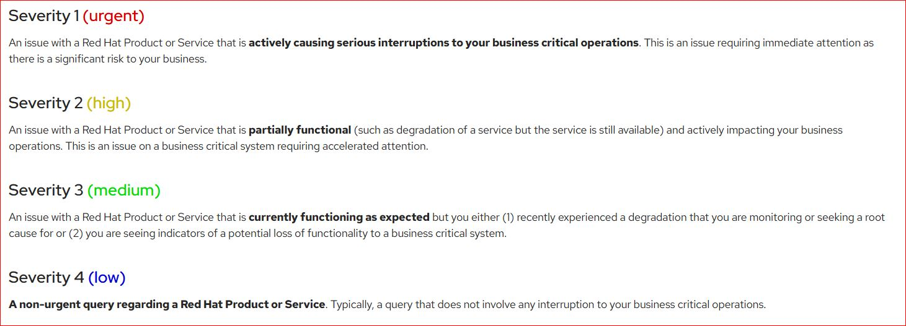
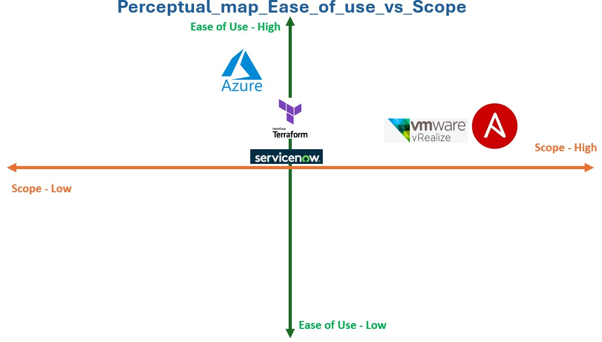
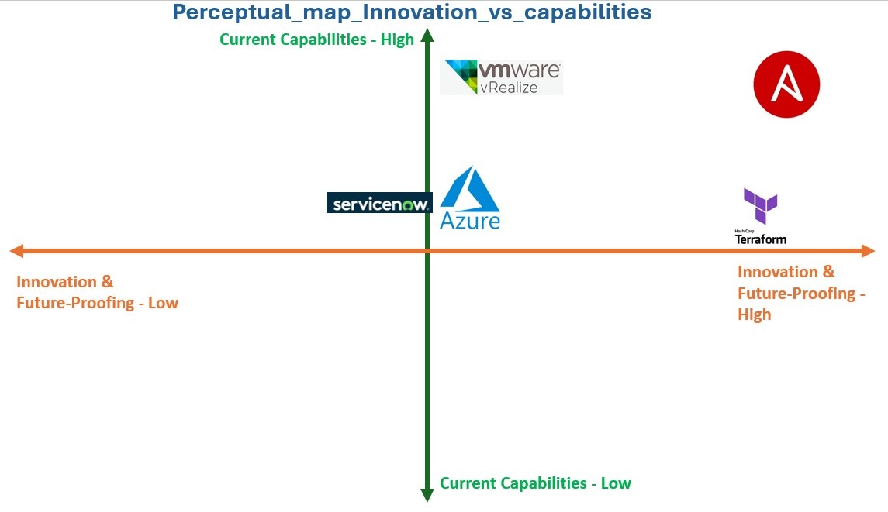

## Introduction
- **Background of the Case Study**
In this competitive evolving era of technology adopting automation is no more a luxuary rather becoming a neccessasity of the organization of all sizes.Redhat Ansible Automation Platform has evolved as a strong platforms amon its competitors to empowering enterprises to embrace automation at scale.

- **Research Objectives & Questions**
The prime objective of this case study is to discover the reasons behind the success of Redhat Ansible Automation Platform into Enterprise Automation Market.
By the end of this case study you will be able to get answers for the following Questions
1. What are the key features and functionalities of RedHat Ansible Automation Platform that differentiate it from competitors?
2. How does RedHat Ansible Automation Platform help enterprises improve their IT operations and achieve business goals?
3. What are the market trends and adoption rates of RedHat Ansible Automation Platform in various industries?
4. What are the competitive advantages and disadvantages of RedHat Ansible Automation Platform compared to other automation platforms?
5. What are the future challenges and opportunities for RedHat Ansible Automation Platform in the evolving automation landscape?

## Company Background
RedHat's story begins in 1993 with the merger of two companies:
- ACC Corporation: A catalog business selling Linux and Unix software accessories.
- Red Hat Software: A company founded by Marc Ewing, known for its Linux distribution, "Red Hat Linux."

This merger laid the foundation for RedHat as a prominent player in the open-source software world.
Red Hat leaders apply open source below principles to their management styles.
- Open exchange
- Transparency
- Meritocracy

The Red Hat business model is based on an open source ecosystem, where collaborative development occurs within a community of professionals focused on providing quality assurance, testing and customer support.
- October, 2018, IBM acquired Red Hat for $34 billion. Red Hat became a business unit of IBM's Hybrid Cloud team, while continuing to preserve the independence and neutrality of Red Hat's open source development heritage.
- September 2019, Redhat introduced the new product "Ansible Automation Platform" a new offering that combines the simple and powerful Ansible solutions with new capabilities for cross-team collaboration, governance and analytics, resulting in a platform for building and operating automation at scale. Along with the Automation platform Redhat introduced Ansible Content Collections,Automation Hub and Automation Analytics.

References:
- https://www.redhat.com/en/about/company/leadership#:~:text=Red%20Hat%C2%AE%20leaders%20apply,how%20we%20continue%20to%20thrive.
- https://www.techtarget.com/searchdatacenter/definition/Red-Hat#:~:text=The%20Red%20Hat%20business%20model,assurance%2C%20testing%20and%20customer%20support.
- https://www.redhat.com/en/blog/introducing-red-hat-ansible-automation-platform

## Industry Background

The network and cloud automation industry has emerged as a critical enabler of digital transformation. As organizations increasingly dependency on complex IT infrastructures, the need for automated solutions to manage and orchestrate these environments has become key requirement. Network automation streamlines network operations, reduces manual errors, and improves agility, while cloud automation optimizes resource allocation, accelerates application deployment, and ease scalability.

Before the dedicated automation and orchestration platforms evolved, organizations used a variety of methods to automate network and cloud tasks, each with its own set of challenges and limitations.

- Manual Processes and Scripting:

1. Manual Configuration: Network devices were often configured manually, a time-consuming and error-prone process.   
2. Custom Scripts: Organizations developed custom scripts using languages like Python or Perl to automate repetitive tasks. However, these scripts were often difficult to maintain, lacked reusability, and required in-depth programming knowledge.   

- Network Management Systems (NMS):

1.  Basic Automation: NMS tools offered limited automation capabilities, such as bulk configuration changes and basic monitoring.
2. Vendor-Specific Solutions: Many NMS tools were vendor-specific, limiting interoperability and flexibility.

- Cloud Provider Tools:

Limited Scope: Cloud providers offered basic tools for managing resources within their respective platforms, but these tools often lacked the flexibility and integration capabilities required for complex automation scenarios.

References:
- https://www.site24x7.com/learn/data-silos-multi-cloud.html
- https://www.megaport.com/blog/how-to-automate-and-orchestrate-your-network-effectively/

**Industry PESTLE Analsysis of Network and Cloud Automation Industry - India specific**

**Political:**

1. Government Initiatives: The Indian government strongly supports digital India initiatives, including the development of data centers and cloud infrastructure. This creates a favorable environment for the growth of the automation industry.
2. Regulatory Landscape: India has data protection laws like the Information Technology Act, 2000, and the Data Protection Bill (under development). These regulations can impact the development and deployment of automation solutions, especially those involving data processing and storage.
3. Government Policies: Government policies promoting technology adoption and innovation, such as "Make in India," can incentivize local development and deployment of automation technologies.

**Economic:**

1. Rapid Economic Growth: India's robust economic growth is driving increased demand for IT infrastructure and services, creating a fertile ground for the network and cloud automation market.
2. Rising Disposable Income: The growing middle class with increasing disposable income is fueling demand for digital services and cloud-based solutions.
3. Cost-Effectiveness: India offers a cost-effective environment for IT services, attracting global companies to set up operations and driving demand for automation solutions.

**Social**

1. Digital India Initiative: The government's Digital India initiative is accelerating digital transformation across various sectors, leading to increased adoption of cloud computing and automation technologies.
2. Young and Tech-Savvy Population: India has a large and young population with a strong affinity for technology, creating a skilled workforce for the IT and automation sector.
3. Growing Demand for Digital Services: The increasing demand for digital services, such as e-commerce, online education, and fintech, is driving the need for robust and scalable IT infrastructure, which can be achieved through automation.

**Technological**

1. Focus on Emerging Technologies: India is actively investing in emerging technologies like AI, ML, and 5G, which are crucial for the development of advanced automation solutions.
2. Growing Cloud Infrastructure: The country is witnessing a rapid growth in cloud infrastructure, providing a strong foundation for cloud-native applications and automation platforms.
3. Skilled IT Talent Pool: India has a large pool of skilled IT professionals, making it an attractive destination for technology companies and fostering innovation in the automation sector.

**Legal:**

1. Data Protection Regulations: As mentioned earlier, data protection regulations can impact the development and deployment of automation solutions.
2. Cybersecurity Concerns: Growing cybersecurity threats are driving demand for automation solutions to enhance security posture and compliance with regulations.
3. Intellectual Property Rights: Protecting intellectual property rights is crucial for businesses operating in the Indian market.

**Environmental:**

1. Focus on Sustainability: There is a growing emphasis on sustainability in India, driving demand for energy-efficient and environmentally friendly automation solutions.
2. Infrastructure Development: The government's focus on infrastructure development, including digital infrastructure, can create opportunities for the deployment of automation technologies.
3. Natural Disasters: India is prone to natural disasters, which can impact IT infrastructure and disrupt business operations. Automation solutions can play a crucial role in disaster recovery and business continuity.

## Market Analysis

**Market Sizing and Target Segments**:

The global network automation market size was valued at USD 4.00 billion in 2019 and is projected to grow USD 22.58 billion by 2027, exhibiting a CAGR of 24.02% during the forecast period.

**Key Target Customer segement include:**

1. Large Enterprises: These organizations have complex IT infrastructures and require comprehensive automation solutions to manage their operations. e.g.
Financial Services: JPMorgan Chase, Bank of America, Goldman Sachs
Technology: Google, Amazon, Microsoft, Meta
Manufacturing: General Motors, Ford, Boeing
Healthcare: Johnson & Johnson, Pfizer, UnitedHealth Group

2. Small and Medium-Sized Enterprises (SMEs): SMEs are increasingly adopting cloud-based solutions and require automation tools to manage their IT resources efficiently.e.g.
Retail: Local boutiques, online retailers
Hospitality: Hotels, restaurants
Education: Schools, universities
Healthcare: Small clinics, private practices

3. Telecom Providers: Telecom providers are leveraging automation to manage their networks and deliver new services. AT&T, Verizon, T-Mobile, du , Etislat, Jio, Airtel.

4. Cloud Service Providers: Cloud providers rely on automation to manage their infrastructure and deliver scalable services to their customers.e.g. Amazon Web Services (AWS), Microsoft Azure, Google Cloud Platform (GCP), IBM Cloud, Oracle Cloud

**Key Trends into Network Automation:**

1. Cloud-Native Technologies: The rise of cloud-native applications and microservices has driven the need for automation solutions that can seamlessly integrate with and manage cloud-based infrastructures.
2. AI and ML Integration: Artificial intelligence (AI) and machine learning (ML) are being integrated into automation platforms to enhance decision-making, predict future needs, and proactively address issues.
3. Multi-Cloud and Hybrid Cloud Adoption: The growing adoption of multi-cloud and hybrid cloud environments necessitates automation solutions that can manage and orchestrate resources across different cloud providers.
4. DevOps and CI/CD: Automation plays a crucial role in DevOps and continuous integration/continuous delivery (CI/CD) pipelines, enabling faster and more frequent software releases.
5. Edge Computing: The emergence of edge computing requires automation solutions that can manage and orchestrate resources at the edge of the network.

Reference:
- https://www.cisco.com/c/en/us/solutions/collateral/executive-perspectives/network-automation-strategy-wp.html

## Product Analysis

**Ansible Automation Platform Product Teardown**

Ansible Automation Platform is a comprehensive enterprise automation solution built upon the widely adopted open-source Ansible project. It is designed to help customers create, manage, and scale automation across various IT environments.

**Core Components & Features**

- • Automation Controller: Provides centralised management for automation, including launching workflows, tracking changes, and integration with existing IT systems. Features include a RESTful API, logging, authentication, and role-based access control.
- • Automation Mesh: Enables scalable and consistent automation across on-premise, hybrid cloud, and edge environments. Provides flexible deployment options from single-site to global installations.
- • Execution Environments: Containerised images acting as Ansible controllers, providing self-contained runtime environments for automation tasks. Simplify the transition from development to production by using execution environments with both Ansible Navigator and Automation Controller.
- • Execution Environment Builder: A command-line tool for packaging automation content into containerised execution environment images.
- • Automation Content Navigator: A command-line tool with an interactive text-based UI for creating and testing automation content, leveraging existing Ansible knowledge and methodologies.
- • Ansible Visual Studio Code Extension: Enhances automation content creation with suggestions and inline documentation.
- • Content Collections: A standardised format for bundling modules, plugins, roles, and documentation, separate from Ansible core, enabling more agile updates and enhancements.
- • Certified Collections: Officially maintained by Red Hat or its partners, guaranteeing quality and compatibility.
- • Automation Hub: A public repository on console.redhat.com hosting supported and certified Ansible content collections.
- • Private Automation Hub: Enables organisations to collaborate, publish, and manage their own automation content and execution environments.
- • Red Hat OpenShift Operator: Facilitates easy installation of Ansible components onto Red Hat OpenShift through OperatorHub.
- • Platform Installer: A downloadable package for installing Automation Controller, Private Automation Hub, Automation Mesh, and content tools on-premise, including disconnected environments.
- • Red Hat Insights for Ansible Automation Platform: An optional hosted service providing a visual dashboard for aggregating and analysing data from multiple Ansible Automation Platform clusters.
- • Automation Services Catalog: A hosted service acting as a lightweight IT service management platform, allowing users to order automation as catalog items. Provides a simplified interface for consuming automation across an organisation.

**Use Cases**

Based on the features described, the Ansible Automation Platform is suitable for various use cases, including:

1. Automating Infrastructure Provisioning and Management: Automating the deployment and configuration of servers, networks, and other infrastructure components across different environments.
2. Application Deployment and Lifecycle Management: Automating the deployment, update, and scaling of applications in on-premise, cloud, and hybrid environments.
3. Configuration Management and Compliance: Ensuring consistency and compliance across systems and applications through automated configuration management and enforcement.
4. Security Automation: Automating security tasks such as vulnerability remediation, user access management, and security policy enforcement.
5. Network Automation: Automating network configuration, management, and monitoring tasks for improved efficiency and security.
6. Cloud Automation: Managing and automating cloud resources across multiple cloud providers, including provisioning, orchestration, and cost optimisation.
7. Self-Service IT: Enabling users to request and consume automation services through a user-friendly catalog interface, improving IT efficiency and user satisfaction.

The Ansible Automation Platform empowers organisations to embrace automation for a wide range of tasks, streamlining operations, reducing costs, and improving efficiency across their IT infrastructure.

**Red Hat Ansible Automation Platform- Ultimate Hands-on Labs**

Redhat provides many sandbox labs for practice , you can refer here pre-solved labs in below article written by me and also the link to book labs.

- LAB-1: Install Red Hat Ansible Automation Platform on Red Hat OpenShift
https://awstip.com/install-red-hat-ansible-automation-platform-on-red-hat-openshift-a24075713550

- LAB-2: Install the private Automation Hub component in Red Hat Ansible Automation Platform on Openshift
https://medium.com/@ranjeetjangra/install-the-private-automation-hub-component-in-redhat-ansible-automation-platform-on-openshift-459549092c3e

- LAB-3: Install Automation Controller via Operator on Ansible Automation Platform on OpenShift
https://medium.com/@ranjeetjangra/install-automation-controller-via-operator-on-ansible-automation-platform-on-openshift-ba8dea7c23a2

- LAB-4: Red Hat Ansible Automation Platform LAB-Retrieve Facts on any Resource
https://medium.com/@ranjeetjangra/redhat-ansible-automation-platform-lab-retrieve-facts-on-any-resource-35048bd0fc92

- LAB-5: Redhat Ansible Automation Platform LAB-Network automation basics: Resource modules
https://medium.com/@ranjeetjangra/redhat-ansible-automation-platform-lab-network-automation-basics-resource-modules-5bdfcee3b679

- LAB-6: Red Hat Ansible Automation Platform LAB: ansible-builder
https://medium.com/@ranjeetjangra/redhat-ansible-automation-platform-lab-ansible-builder-577ca78430eb

- LAB-7: Red Hat Ansible Automation Platform Lab (Writing your First Playbook)
https://medium.com/@ranjeetjangra/red-hat-ansible-automation-platform-lab-3-writing-your-first-playbook-b3145b12a9ec

- LAB-8: Red Hat Ansible Automation Platform LAB: Ansible Roles
https://medium.com/@ranjeetjangra/redhat-ansible-automation-platform-lab-ansible-roles-e97235660c6c

Reference
- Product Features https://www.youtube.com/watch?v=7GJjhZoYEus
- Hands-on Labs https://medium.com/techbeatly/red-hat-ansible-automation-platform-ultimate-hands-on-labs-3cdef1a9e935

## Marketing & Sales
- Marketing Mix (4Ps or 7Ps)

### Sales Channels & Distribution**

Red Hat Ansible Automation Platform (AAP) employs a robust sales and distribution strategy to reach enterprises and organizations globally.

**key sales and distribution channels**

1. **Direct Sales**
**Enterprise Account Managers:** Red Hat employs a dedicated sales force to work directly with large enterprises, providing tailored solutions.Benefits of this sales method are Customized demonstrations, Proof of Concepts (PoCs), and workshops to showcase value and Focus on long-term subscription renewals and customer success.

2. **Partner Ecosystem**
- Channel Partners: Red Hat collaborates with a global network of Value-Added Resellers (VARs), Managed Service Providers (MSPs), and distributors.Partners like Value-Added Resellers (VARs) and Independent Software Vendors (ISVs) provide Ansible solutions as part of integrated offerings, making it easier to adopt.Red Hat Certified Partners deliver pre-packaged automation solutions.Partners offer managed services, making Ansible appealing to customers without in-house expertise. various VARs of RedHat are CDW,Softchoice,SHI International,Insight,Zones,NTT Data,XenonStack etc. NTT and XenonStack are Asia based VARs.

3. **Events and Webinars**
- **Red Hat Summit:** Annual conferences showcase the capabilities of Ansible Automation Platform alongside other Red Hat offerings.

- Redhat Summit https://www.redhat.com/en/summit showcase how Redhat attracting registrations for various Persona like: 

1. **Maker:** Maker typically likes: Power Training, labs, lightning talks, breakout sessions, keynotes, expo hall
2. **Amplifier:** Amplifier typically likes: labs, lightning talks, expo hall, breakout sessions, keynotes
3. **Multiplier:** Multiplier typically likes: Briefing Center, panels, keynotes, breakout sessions, expo hall
4. **Catalyst:**  Catalyst typically likes: roundtable discussions, panels, keynotes, Briefing Center, expo hall, evening receptions
5. **Connector:** Connectors typically likes: partner ecosystem keynote, expo hall, breakout sessions, sponsored events, Briefing Center

**Other Secondary Sales Methods**

- **Online Marketplace :** Making the Ansible AAP available at various Cloud Marketplaces like AWS Marketplace,Microsoft Azure Marketplace, Google Cloud Marketplace
- **Technology Alliances :** Collaborations with technology vendors (e.g., Cisco, VMware, IBM, and SAP) ensure compatibility and drive co-selling opportunities.
- **Digital Marketing** : Redhat uses various digital marketing techniques like:
- 1. **Content Marketing:** Blogs, whitepapers, and case studies showcasing Ansible Automation use cases.
- 2. **SEO and Ads:** Online campaigns target IT decision-makers searching for automation solutions.
- 3. **Social Media & Community Engagement:** Active presence in forums, LinkedIn, and Twitter to engage users and developers.

### Pricing Strategies

**Subscription Types**

**Standard Subscription:**

1. Manage any size environment
2. Enterprise 8x5 support and SLA (As per below Severity Level Definitions )
3. Maintenance and upgrades included

**Severity Level Definitions**

Redhat follows below Severity level definitions

**Premium Subscription**
- Manage any size environment, including mission-critical environments
- Premium 24x7 support and SLA
- Maintenance and upgrades included (As per above Severity Level Definitions )

While requesting for any redhat subscription user need to fill the  subscriptions manifest .
Customer needs to specify the number of entitlements or managed nodes to put in the manifest file. This enables you to split up a subscription, for example: 400 nodes on a development cluster and 600 nodes for the production cluster, out of a 1000 node subscription. Manifest files can be easily exported and imported.

**Customer/Buyer Persona's**

1. **Maker:** Maker typically likes: Power Training, labs, lightning talks, breakout sessions, keynotes, expo hall.
These are companies focused on building, deploying, and customizing automation solutions for their unique internal needs.
e.g. Startups in the FinTech industry like Plaid or Stripe, Game development companies like Epic Games

2. **Amplifier:** Amplifier typically likes: labs, lightning talks, expo hall, breakout sessions, keynotes
These companies utilize automation to enhance existing processes, aiming to achieve operational excellence by scaling and optimizing their workflows. e.g. Manufacturing giants like Siemens or General Electric (GE) which implement automation to improve factory operations, Retail chains like Walmart automating supply chain and inventory management.

3. **Multiplier:** Multiplier typically likes: Briefing Center, panels, keynotes, breakout sessions, expo hall
These organizations are leaders in driving automation adoption across multiple teams or business units, often creating a culture of automation within the company.e.g. Large IT service companies like TCS, Infosys, or Cognizant, promoting automation across their diverse client portfolios. Global technology leaders like Dell or Hewlett Packard Enterprise (HPE), which use automation to scale IT operations globally.

4. **Catalyst:**  Catalyst typically likes: roundtable discussions, panels, keynotes, Briefing Center, expo hall, evening receptions
These are innovators and early adopters who experiment with automation in cutting-edge ways, inspiring others within their industry.
e.g. Tech pioneers like Tesla, automating processes for software updates, energy solutions, and production workflows.Space companies like SpaceX, leveraging automation for mission-critical tasks.

5. **Connector:** Connectors typically likes: partner ecosystem keynote, expo hall, breakout sessions, sponsored events, Briefing Center. These organizations actively share their automation experiences, contribute to open source, and collaborate within the community to drive collective progress. e.g. Open-source contributors like Canonical or HashiCorp, which thrive on community collaboration and knowledge sharing.

**perceptual Maps**

**Ease of Use vs Scope**

Red Hat Ansible Automation Platform placed in the High Scope, Moderate Ease of Use quadrant.
Ansible is known for its powerful automation capabilities and extensive library of modules. However, it can have a steeper learning curve compared to some competitors.

**Innocation & Future Proofing vs Current Capabilities**

Red Hat Ansible Automation Platform: Ansible's focus on open-source, strong community support, and continuous development positions it as a platform that is likely to adapt and evolve with future IT trends. Its current capabilities are also robust and widely recognized. Redhat AAP has been placed in High Innovation & Future-Proofing, High Current Capabilities:

)

Reference:
- Subscription Model https://access.redhat.com/articles/6057451
- How to obtain subscription manifest https://docs.redhat.com/en/documentation/red_hat_ansible_automation_platform/2.4/html/automation_controller_user_guide/controller-managing-subscriptions#controller-managing-subscriptions
- Deployment Model and Pricing Model https://connect.redhat.com/sites/default/files/2022-01/Red_Hat_CCSP_Program_Guide_January_2022.pdf
- Legacy IT investments in the public sector https://www.redhat.com/en/resources/accelerate-public-sector-digital-transformation-red-hat-ansible-automation-platform

## Operations & Technology
- Production Process & Supply Chain
- Technology Infrastructure & Innovation
- Operational Efficiency & Cost Optimization

## Financial Analysis
- Revenue Models & Profitability
- Financial Statements & Ratios
- Key Performance Indicators (KPIs)
- Investment & Funding

## Competitive Analysis
- Competitive Landscape & Benchmarking
- SWOT Analysis of Competitors
- Competitive Advantages & Disadvantages

## SWOT Analysis
- Internal Strengths & Weaknesses
- External Opportunities & Threats

## Strategic Analysis
- Porter's Generic Strategies (Cost Leadership, Differentiation, Focus)   
- Blue Ocean Strategy
- Growth Strategies (Market Penetration, Market Development, Product Development, Diversification)

## Data Analysis
- Data Collection & Sources
- Data Visualization & Interpretation
- Statistical Analysis & Modeling

## Recommendations & Conclusions
- Strategic Recommendations & Action Plans
- Implementation Plan & Timeline
- Key Learnings & Insights

## References
- List of all sources used

## Appendices
- Supporting Documents (e.g., financial statements, market research reports, interviews)